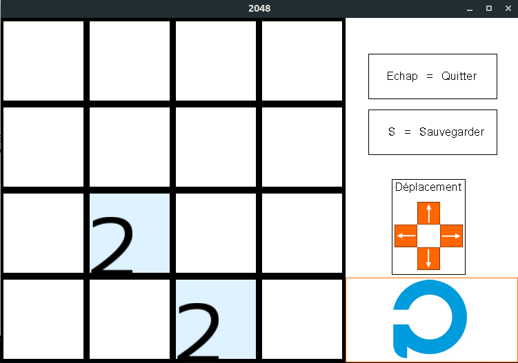

# 2048

This repository is project I made with a class mate during my first year of preparation for the Polytech Engineering school network.

It's an implementation of the famous game 2048 in C++

you can use it in the bash or in graphic mode

## Installation

First you need to install the sfml (which allows to make the gui) :
```bash
sudo apt-get install libsfml-dev
```
Then you can build the program and launch it :
```bash
make
./bin/game
```

## Screensot

